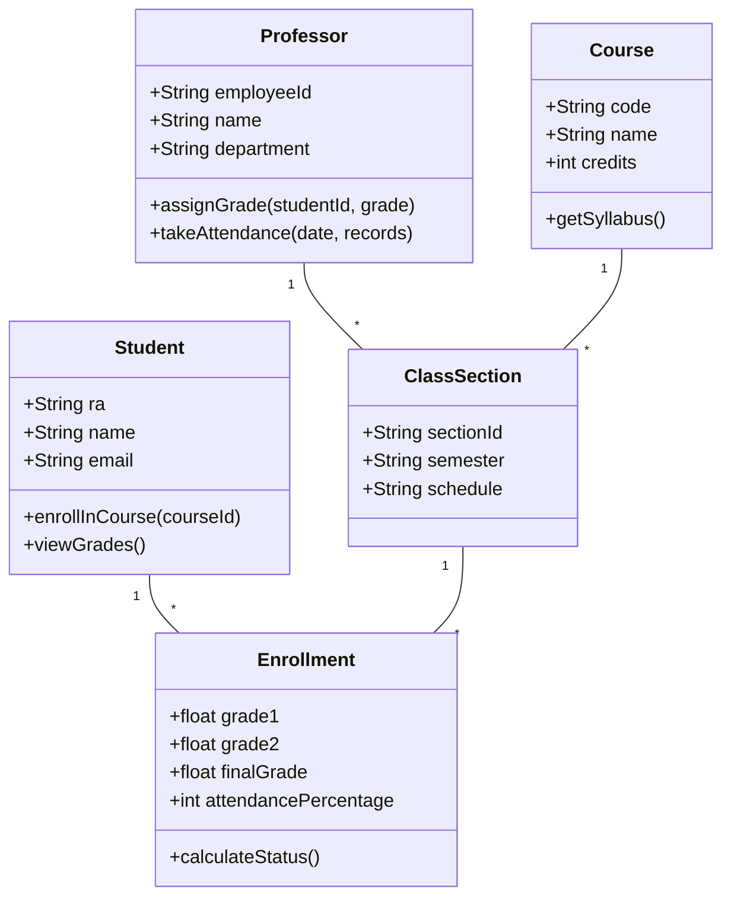

# Academic Control System (SiCAd) - UML System Modeling

## 1. System Overview

The Academic Control System (SiCAd) is an enterprise academic management system designed to manage student enrollments, course offerings, grade submissions, and professor assignments.

## 2. Core Domain Entities

* **Student:** Represents enrolled students with unique registration IDs (RA) and academic history.
* **Professor:** Manages course sections, submits attendance records, and inputs grades.
* **Course / Discipline:** Represents academic subjects offered across different semesters.
* **Enrollment:** Links a student to a specific course section and tracks final grades and attendance.

## 3. Class Diagram Specification

## 4. Use Case Scenarios

1. **Grade Submission:** Professor authenticates, selects an assigned class section, inputs grades for enrolled students, and locks the grade sheet upon final submission.
2. **Course Enrollment:** Student selects available sections during the registration window, verifies prerequisites, and confirms enrollment.
