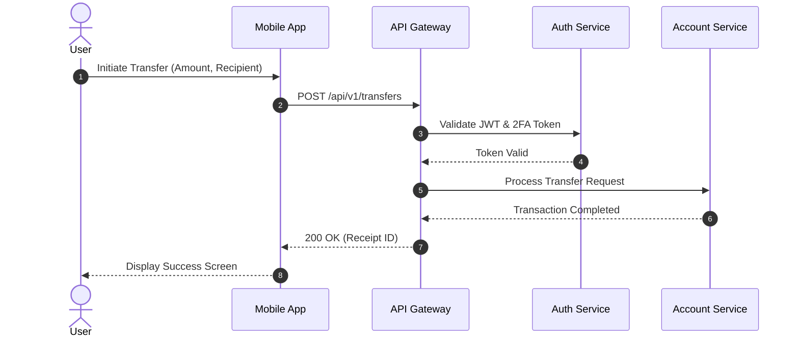
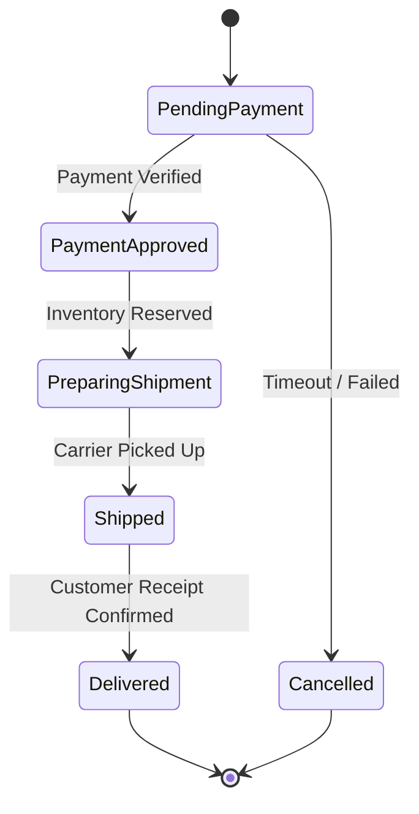

# Module 02: UML Domain Case Studies

This document presents UML modeling solutions for real-world enterprise architectures across multiple domain case studies.

---

## Case 1: Digital Banking - Sequence Diagram

---

## Case 2: E-Commerce Order Processing - State Diagram

